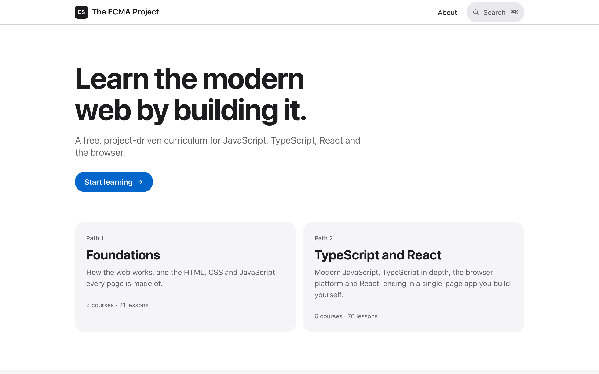
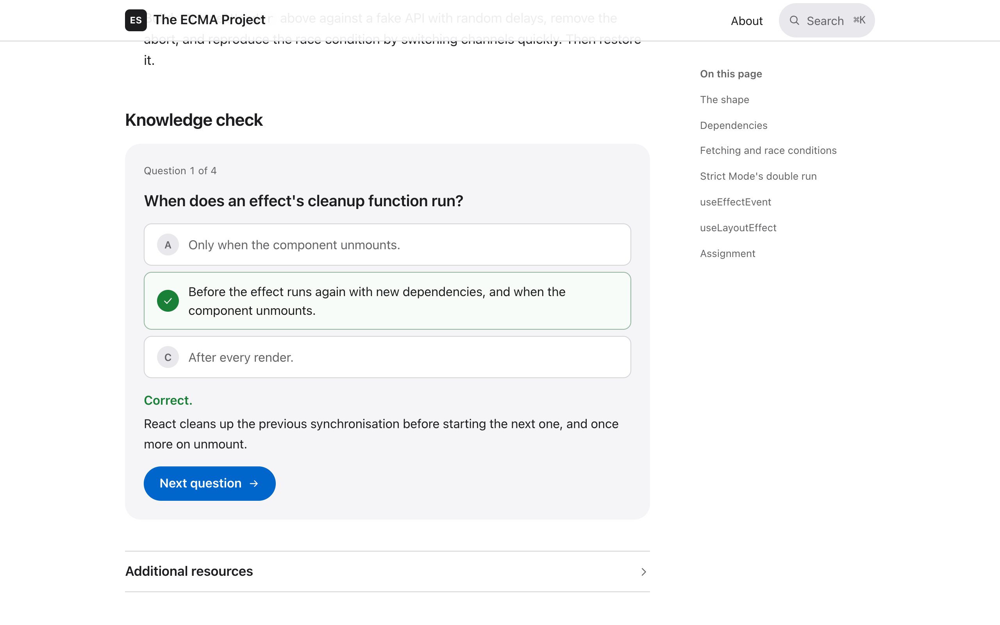
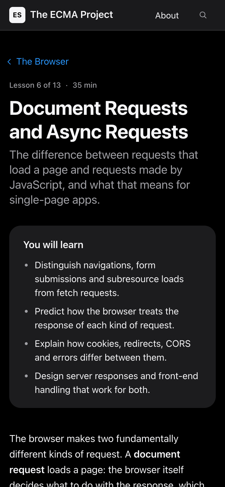
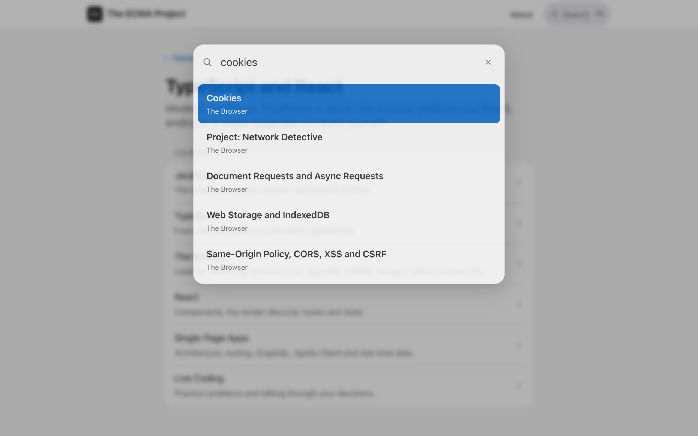

<div align="center">

# The ECMA Project 🧭

<kbd>
    
</kbd>

## Project Description 🎨

The ECMA Project is a free, project-driven curriculum for building for the web with modern JavaScript, TypeScript and React: <https://arieltyson.github.io/ecma-project/>. It follows the structure of The Odin Project, with paths made of courses, and courses made of lessons and projects. There are 97 lessons across two paths. Foundations covers how the web works, HTML, CSS and JavaScript basics. TypeScript and React covers modern JavaScript, TypeScript in depth, the browser platform (rendering, the event loop, document and async requests, cookies, storage, history and security), React 19, single-page app architecture with GraphQL and Apollo Client, and live coding practice. Every lesson ends with an assignment and a knowledge check. Every project lists requirements, failures to introduce on purpose, and questions to explain afterwards. Tested starter files for the code-heavy projects are in `exercises/`.

## Screenshots:

<div style="display: flex; justify-content: center; align-items: center;">
    <kbd>
        
    </kbd>
    <kbd>
        
    </kbd>
    <kbd>
        
    </kbd>
</div>

## Technologies Used 💻

### Frameworks

- [x] **React 19**: function components, `use`, Suspense, transitions and `useSyncExternalStore`, built with the React Compiler
- [x] **TypeScript 7**: strict mode plus `noUncheckedIndexedAccess`, `exactOptionalPropertyTypes`, `verbatimModuleSyntax` and `erasableSyntaxOnly`
- [x] **Vite 8**: development server, code splitting by lesson, and a server build used for prerendering
- [x] **unified, remark and rehype**: lessons compiled from Markdown at build time
- [x] **Shiki**: syntax highlighting at build time into CSS variables, so one theme serves light and dark
- [x] **Zod**: validation of every lesson's frontmatter
- [x] **Vitest, Testing Library and jsdom**: tests for content, the design system, routing, search and every prerendered page
- [x] **oxlint and Prettier**: linting and formatting

### APIs & Web Services

- [x] **GitHub Pages**: static hosting of the prerendered site
- [x] **GitHub Actions**: format, lint, type-check, snippet check, build, test and deploy on every push

### Data Sources

- [x] **content/catalog.ts**: the order of every path, course and lesson
- [x] **content/lessons/**: one Markdown file per lesson, with frontmatter for objectives, quiz questions and resources
- [x] **src/design/tokens.ts**: every colour, length, type style and duration, as light and dark pairs where relevant
- [x] **exercises/**: starter files and tests for the chat log parser, event bus, route builder and utility drills

</div>

## Architecture 🏛️

- **Pattern**: Content as code. A Vite plugin turns `content/` into a typed catalog module and one code-split module per lesson. Every route is prerendered to its own HTML file, then hydrated
- **Routing**: A small History API router with typed routes, scroll restoration per history entry, and focus moved to each page's heading after navigation
- **Data loading**: Lesson bodies load through `use()` and a promise cache, inside transitions, so the current page stays visible while the next one loads
- **State**: Lesson progress and appearance are external stores read with `useSyncExternalStore`, with server snapshots so prerendered HTML always matches the first client render
- **Design system**: Tokens follow the Apple Human Interface Guidelines (system font, iOS text styles, a 4 point grid, 44 point targets) and are rendered to CSS custom properties. Stylesheets reference tokens only
- **Quality gates**: Prettier, oxlint, `tsc` on the app and tooling, a type-check of every TypeScript snippet in the lessons, WCAG contrast tests, content tests (frontmatter, quizzes, internal links) and built-page tests (language, title, landmarks, heading order, unique IDs, named controls, security policy)
- **Runtime dependencies**: React and React DOM only
- **Target**: Evergreen browsers; tooling needs Node.js 24

## Features 🚀

- 🧭 **Two paths**: Foundations, then TypeScript and React, in the shape of The Odin Project
- 🔷 **TypeScript in depth**: 22 lessons from the compiler to conditional, mapped and template literal types, branded types and runtime validation
- 🌐 **The browser platform**: rendering, the event loop, DevTools, HTTP caching, document versus async requests, cookies, storage, history and security
- ⚛️ **React 19 and single-page apps**: rendering, state, actions, effects, external stores, the compiler, Suspense, testing, GraphQL and Apollo Client
- 🛠️ **Projects with tests**: starter files and test suites in `exercises/`, run with `npm run exercise <name>`
- ✅ **Knowledge checks**: one question at a time with instant, explained feedback
- 🔎 **Search**: press `⌘K` or `/` to search titles, summaries and objectives
- 📈 **Progress**: mark lessons complete; progress stays in your browser
- 🌗 **Light and dark**: follows the system, with a manual override
- ♿ **Accessible**: keyboard operable, screen reader friendly, readable without JavaScript

## Running Locally 🛠️

```sh
npm ci
npm run dev                   # http://localhost:5173/ecma-project/
npm run build                 # prerenders every page into dist/
npm run preview               # serves dist/
npm run check                 # format, lint, type-check, snippets, build and tests
npm run exercise event-bus    # type-check and test one exercise
```

To add a lesson, write `content/lessons/<course>/<slug>.md` with the frontmatter described in `src/content/schema.ts`, and add its slug to `content/catalog.ts`. The build fails if a lesson is missing from the catalog or the catalog lists a missing lesson. TypeScript code blocks are type-checked; fence a deliberately partial example as `ts nocheck`.

## Privacy 🔏

The ECMA Project does not use cookies, analytics or trackers, and makes no requests to third parties. It stores your completed lessons and your appearance choice in your own browser's local storage. The site is hosted by GitHub Pages, which may log visitor IP addresses under the [GitHub Privacy Statement](https://docs.github.com/en/site-policy/privacy-policies/github-general-privacy-statement).

<div align="center">

## Contributing ⚙️

Contributions are welcome. Fork the repository, create a branch, make your change with tests, run `npm run check`, then open a pull request that explains the change. Lessons should be concise, cite official documentation in their resources, and use only examples that type-check under the strict configuration.

## License 🪪

This project is licensed under the MIT License. See `LICENSE` for details.

</div>
